# Jarkom_Modul1_Lapres_D08
## Display Filter
#### 1
http.host == "testing.mekanis.me"

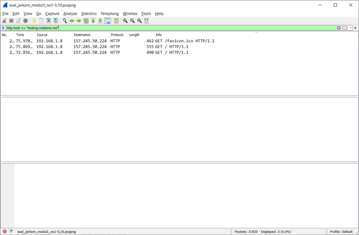

Klik kanan pada salah satu hasil lalu Follow -> HTTP stream

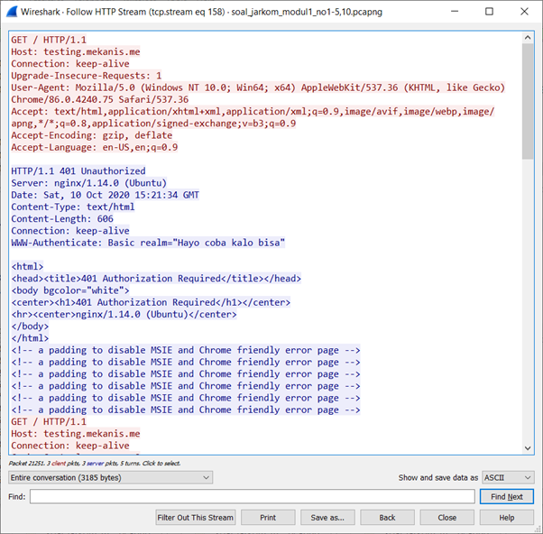

Ditemukan webserver adalah nginx
#### 2
klik File > Export Object > HTTP > pada Text Filter ketik “Tim_Kunjungan_Kerja_BAKN_DPR_RI_ke_Sukabumi141436.jpg”

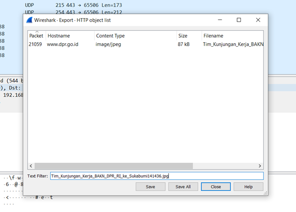
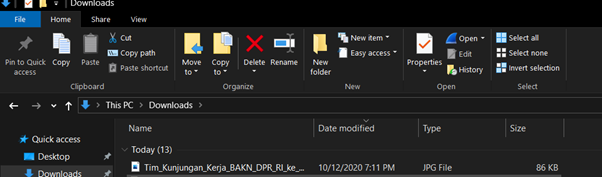
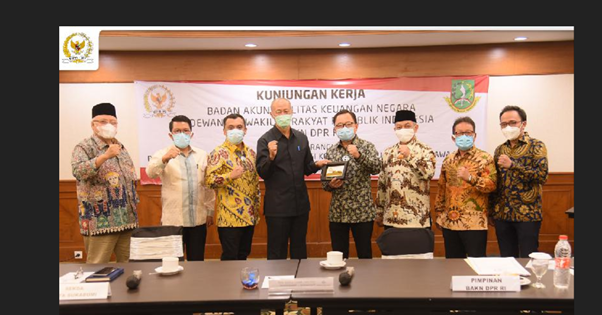
#### 3
http.request.uri contains "login" && http.host == "ppid.dpr.go.id"

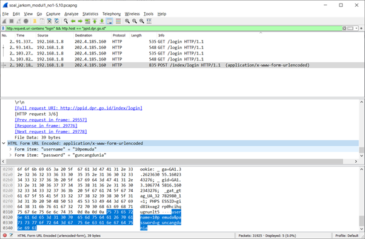

Ditemukan username dan password:
username = 10pemuda
password = guncangdunia
#### 4
http.authbasic

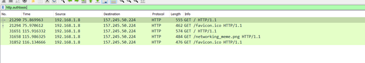
#### 5
http.host == “aku.pengen.pw”
Pada salah satu hasil, cari Hypertext Transfer Protocol > Authorization

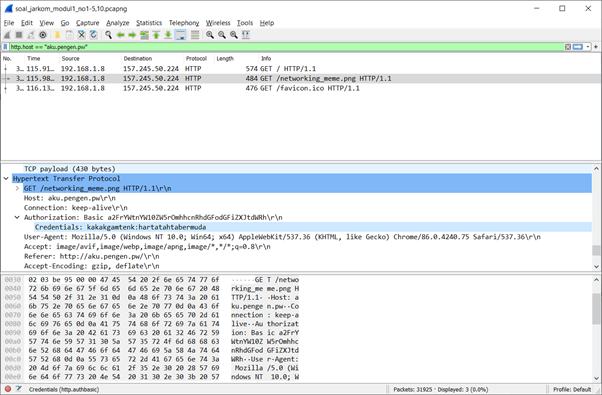
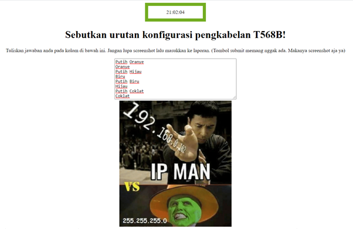
#### 6
ftp-data.command == "STOR Answer.zip"

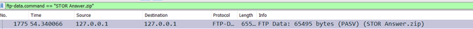

di Answer.zip klik kanan > follow > TCP stream > ubah save data as dalam bentuk raw kemudian save
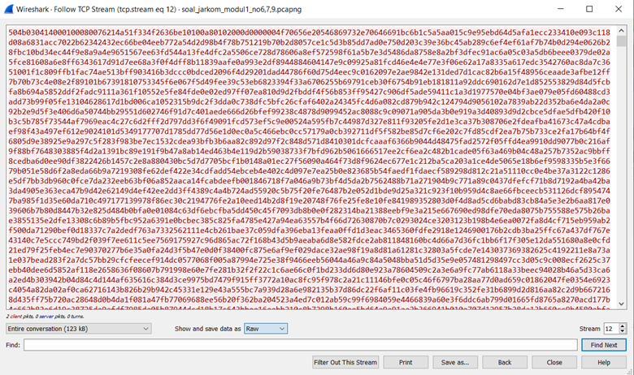

hasil download
< img src="images/6_2.png">

ftp-data.command == "STOR zipkey.txt"

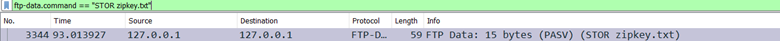

di zipkey.txt klik kanan > follow > TCP stream > ubah save data as dalam bentuk raw kemudian save

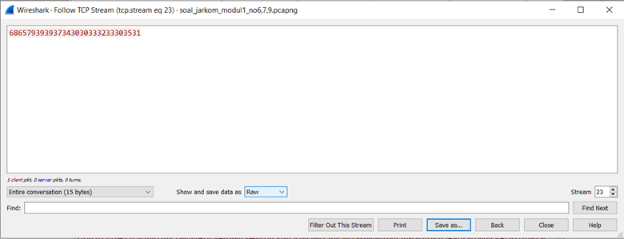

hasil open this

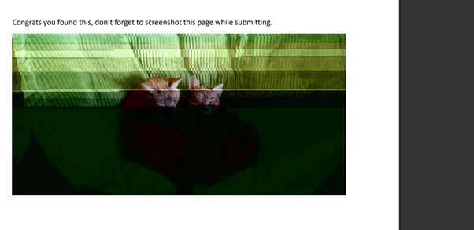
#### 7
frame contains "Yes.pdf"
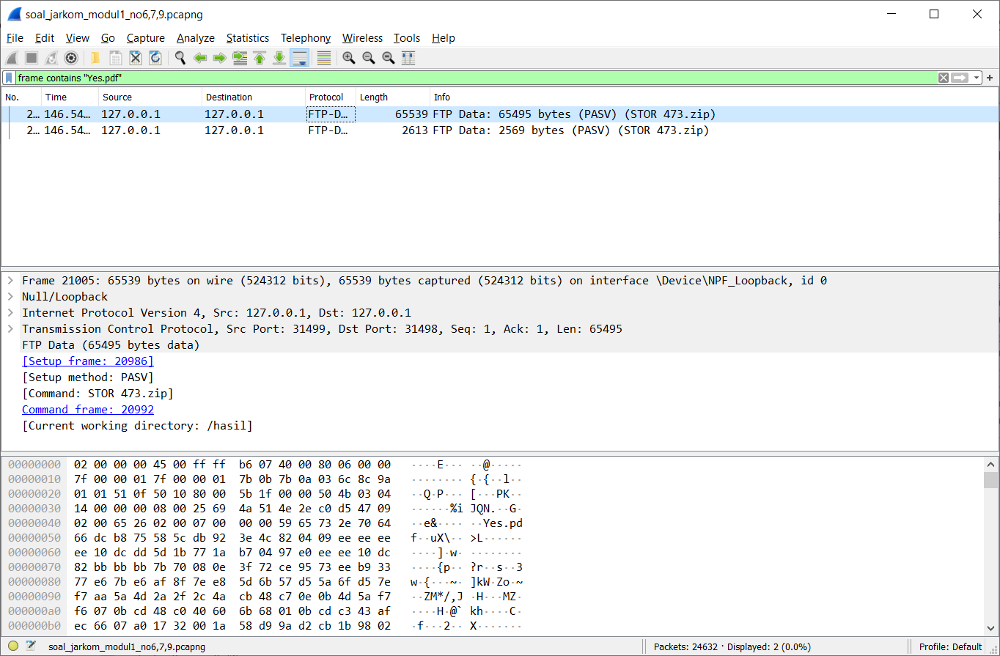

Setelah ditemukan, klik kanan pada salah satu lalu klik Follow > TCP Stream > lalu save as raw dan save dalam bentuk .zip

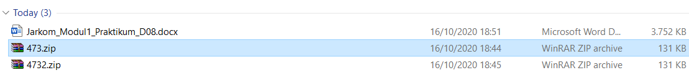
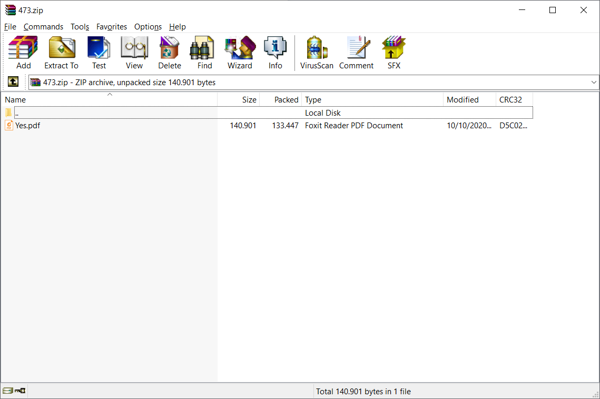
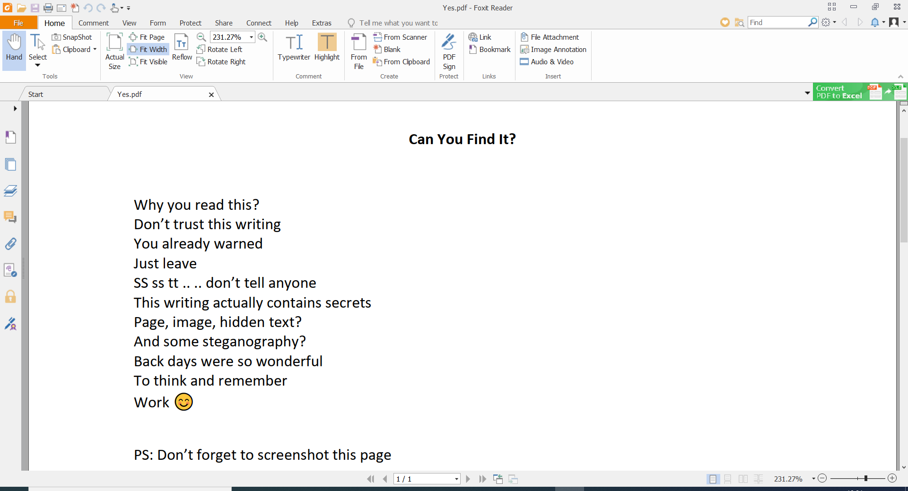
#### 8
ftp.request.command == RETR

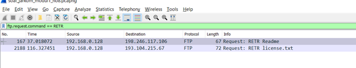
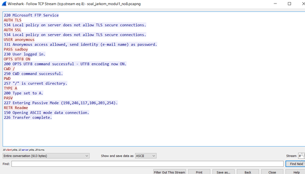

karena di follow > tcp stream pada readme menunjukkan Microsoft FTP service maka yang mendownload readme tersebut adalah Microsoft FTP service 
#### 9
ftp.request.command == USER || ftp.request.command == PASS

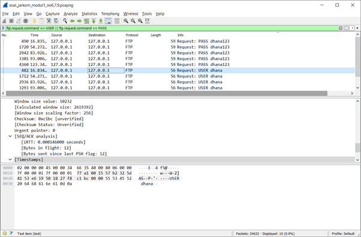

user = dhana
pass = dhana123
#### 10
frame contains "application/pdf"

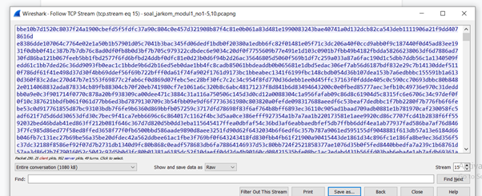
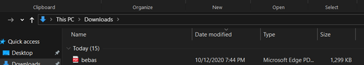

hasil

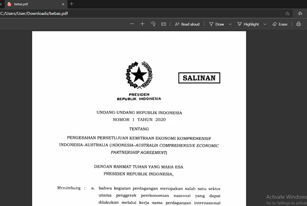
## Capture Filter
#### 11
port 21
Pilih adapter for loopback traffic capture dan ketik port 21 di capture filter nya

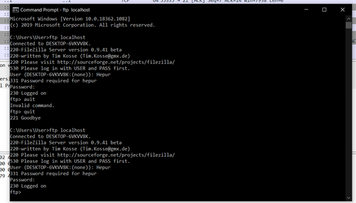

muncul hasil ftp

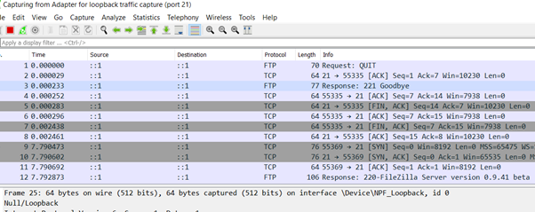
#### 12
src port 80

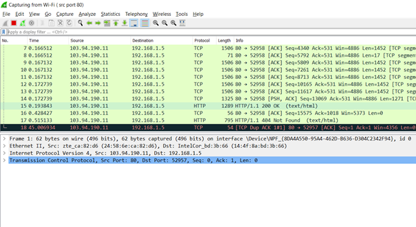
#### 13
dst port 443

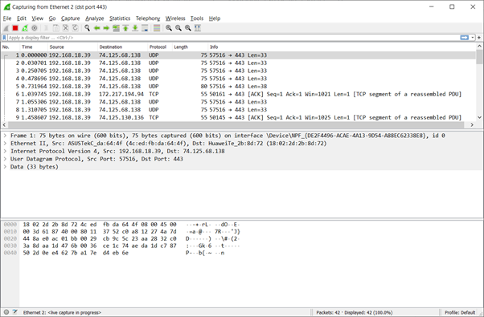
#### 14
src host 192.168.1.5
IP didapat dari command ipconfig di command prompt(Windows)

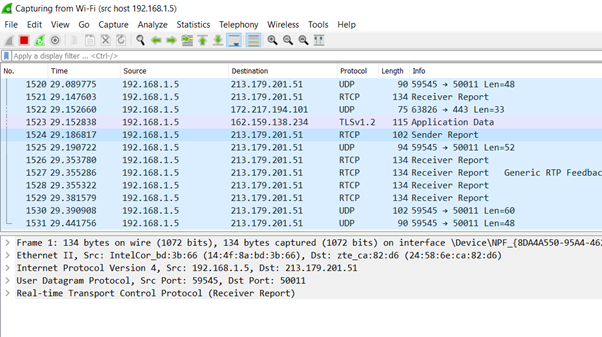
#### 15
dst host monta.if.its.ac.id

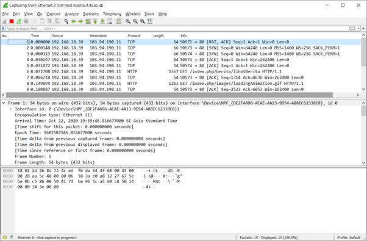
